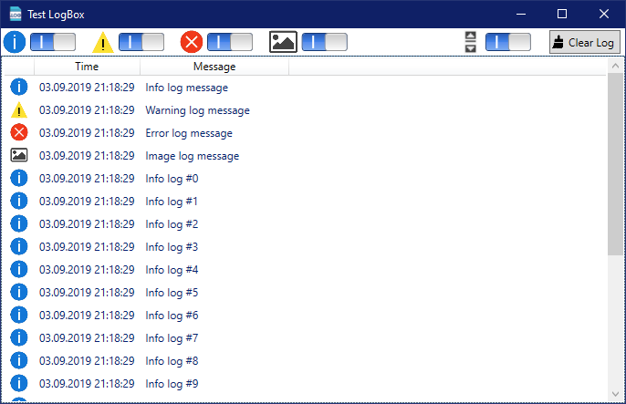

# LogBox

Version: %version%

A WPF control to display log events.

Available types of log events are:

| Type    | Description                                                            | 
| ------- | ---------------------------------------------------------------------- |
| Info    | Use this to show informations.                                         |
| Warning | Use this to show warning.                                              |
| Error   | Use this to show errors.                                               |
| Image   | Use this to display image to the user (for example for debug purpose). |

## Installation
Include the [latest release from nuget.org](https://www.nuget.org/packages/LogBox/) in your project.

You can also use the Package Manager console with: `PM> Install-Package LogBox`

## Usage
Include the following namespace in your .xaml:
```C#
xmlns:logBox="clr-namespace:LogBox;assembly=LogBox"
```

Insert the control with:
```C#
<logBox:LogBoxControl x:Name="logBoxCtrl"/>
```

To add log entries use the controls `LogEvent` method like:
```C#
LogBoxCtrl.LogEvent(new LogBox.LogEventInfo("Info log message"));
```

For further examples see the LogBoxTest project.

## Screenshots



## App Icon
Icon made by Flat Icons from www.flaticon.com